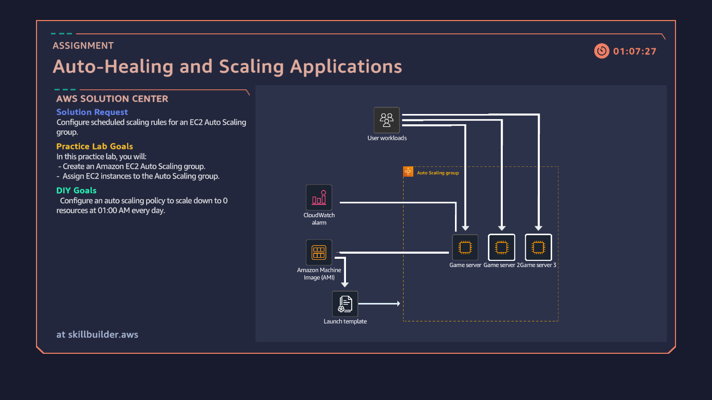
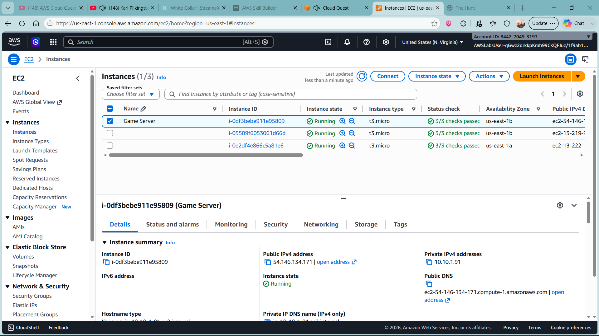
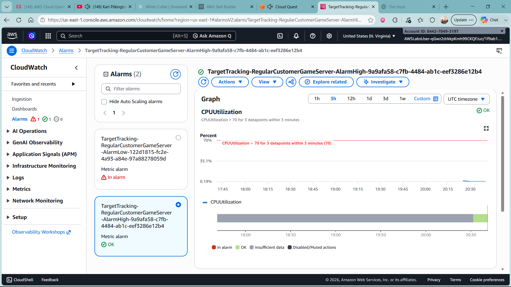

# aws-ec2-auto-scaling-lab
A practical AWS lab documenting how to create an EC2-based game server environment, configure an Auto Scaling group, apply CPU-based scaling, schedule capacity changes, and review monitoring data.

# AWS EC2 Auto Scaling Lab

## Project Overview

This project demonstrates the configuration of an Amazon EC2 Auto Scaling group for a game server workload using the AWS Management Console.

The lab focuses on creating a reusable Amazon Machine Image (AMI), defining an EC2 launch template, configuring an Auto Scaling group across multiple Availability Zones, implementing CPU-based target tracking, scheduling capacity changes, and reviewing CloudWatch monitoring data.

The objective is to understand how AWS can automatically maintain server capacity and respond to changes in workload demand.

## Objectives

* Create an AMI from an existing game server instance.
* Configure an EC2 launch template.
* Create an Auto Scaling group across two Availability Zones.
* Configure minimum, desired, and maximum instance capacity.
* Implement a target tracking scaling policy based on average CPU utilisation.
* Schedule a recurring increase in capacity.
* Review Auto Scaling activity and CloudWatch alarms.

## Architecture

The environment uses an existing game server as the source for an AMI. The AMI is referenced by a launch template, which provides the configuration for instances launched by the Auto Scaling group.

The group spans two Availability Zones within a custom VPC. A target tracking policy responds to average CPU utilisation, while a scheduled action increases the desired capacity during a specified weekly period.

CloudWatch provides monitoring data and alarm information that can help an engineer understand scaling activity.

## AWS Services Used

| Service                                  | Purpose                                                 |
| ---------------------------------------- | ------------------------------------------------------- |
| Amazon EC2                               | Hosts the game server instances.                        |
| Amazon Machine Images (AMIs)             | Provides a reusable image of the existing server.       |
| EC2 Launch Templates                     | Defines the configuration for newly launched instances. |
| EC2 Auto Scaling                         | Maintains and adjusts the number of instances.          |
| Amazon CloudWatch                        | Provides monitoring metrics and alarm information.      |
| Amazon VPC                               | Provides the network environment and subnets.           |
| AWS Identity and Access Management (IAM) | Controls permissions to AWS resources.                  |

## Implementation

### 1. Create an Amazon Machine Image

Created an AMI from the existing game server instance.

* Image name: `GameServer`
* Image description: `Game server image`

The AMI serves as the reusable server image for subsequent instance launches.

### 2. Create an EC2 Launch Template

Created a launch template named `GameServerTemplate`.

* Template version description: `Game server template`
* AMI: `GameServer`
* Instance type: `t3.micro`
* Key pair: `GameServerKeyPair`
* Security group: `WebServerSecurityGroup`

The launch template standardises the configuration of instances launched by the Auto Scaling group.

### 3. Create an Auto Scaling Group

Created an Auto Scaling group named `RegularCustomerGameServer`.

The group was associated with the custom game server VPC and subnets in two Availability Zones.

| Setting                   | Configured value     |
| ------------------------- | -------------------- |
| Launch template           | `GameServerTemplate` |
| Minimum capacity          | 2 instances          |
| Desired capacity          | 2 instances          |
| Maximum capacity          | 4 instances          |
| Health check grace period | 240 seconds          |
| Load balancer             | None                 |
| Availability Zones        | Two                  |

The minimum capacity helps maintain a baseline number of instances, while the maximum capacity limits the number of instances the group can scale out to.

### 4. Configure Target Tracking Scaling

Created a dynamic scaling policy with the following configuration:

* Policy name: `CPU Utilization`
* Policy type: Target tracking scaling
* Metric: Average CPU utilisation
* Target value: 70%

The policy allows Auto Scaling to adjust the number of instances in response to changes in average CPU utilisation.

For example, if sustained workload demand increases CPU utilisation above the target, the group may launch additional instances, provided that scaling conditions are met and the maximum capacity has not been reached.

When demand decreases, Auto Scaling may reduce the number of instances while respecting the configured minimum capacity.

### 5. Configure a Scheduled Scaling Action

Created a scheduled action named `SecondWaveOfRegulars`.

| Setting          | Configured value                                        |
| ---------------- | ------------------------------------------------------- |
| Desired capacity | 3                                                       |
| Minimum capacity | 3                                                       |
| Maximum capacity | 4                                                       |
| Recurrence       | Weekly                                                  |
| Scheduled time   | 20:00 on the selected start date and recurring schedule |

The scheduled action raises the baseline capacity to three instances for the scheduled period.

Scheduled scaling is useful when workload demand follows a predictable pattern, such as a game server expecting more users at a regular time.

The schedule's time zone and recurrence settings should be verified in the AWS console.

### 6. Review Auto Scaling Activity and CloudWatch

Reviewed the Auto Scaling group's activity history to check the status of instance launches and scaling operations.

Also inspected the relevant CloudWatch alarm data to understand how monitoring relates to scaling behaviour.

Successful activity entries and alarm metrics should be used to verify actual outcomes rather than assuming that creating a policy guarantees a scaling event.

## Skills Demonstrated

### Cloud Infrastructure

* Provisioning and managing EC2 instances.
* Creating and reusing Amazon Machine Images.
* Configuring EC2 launch templates.
* Working with VPCs, subnets, and Availability Zones.

### Automation and Scalability

* Configuring Auto Scaling group capacity.
* Implementing CPU-based target tracking.
* Creating scheduled scaling actions.
* Understanding elasticity and capacity management.

### Monitoring and Operations

* Reviewing Auto Scaling activity history.
* Inspecting CloudWatch metrics and alarms.
* Understanding scaling events and instance health.
* Verifying infrastructure behaviour through monitoring data.

### Security Awareness

* Configuring instance security group associations.
* Understanding EC2 key-pair usage.
* Recognising the importance of protecting private keys and restricting network access.

## Challenges and Learning Outcomes

This lab helped develop an understanding of how AWS combines reusable instance configurations, automated capacity management, scheduled actions, and monitoring.

It also highlights the difference between reactive scaling, which responds to workload metrics, and scheduled scaling, which anticipates predictable demand.

A key operational lesson is that a successful configuration does not automatically prove that scaling works as intended. Activity records, instance states, metrics, and alarm history provide the evidence needed to validate the implementation.

## Future Improvements

* Test scale-out and scale-in behaviour under controlled CPU load.
* Compare scheduled scaling with target tracking during a predictable workload.
* Add an Application Load Balancer if the application requires traffic distribution across instances.
* Explore infrastructure as code using AWS CloudFormation or Terraform.
* Add a monitoring dashboard and document the observed scaling events.

## Disclaimer

This repository documents an educational AWS lab. Resource names and configuration details are provided for learning purposes. No AWS credentials, private keys, customer data, or confidential information should be committed to the repository.
